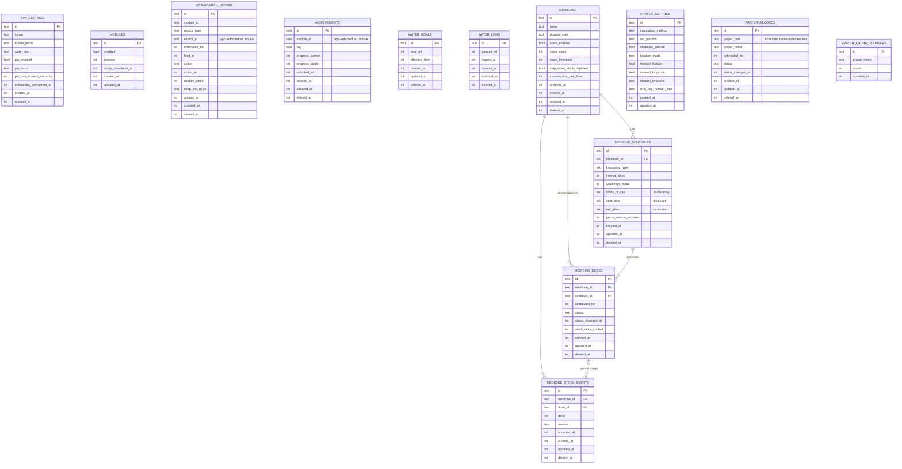

# Entity-Relationship Diagram

Full schema per `database-design.md`. Polymorphic/loose references
(`notification_ledger.source_id`, `achievements.module_id`) are shown as
dashed relationships since they are application-enforced, not DB foreign
keys — see that document for why.

Deliberately excluded from FK arrows on the diagram (per `database-design.md`):
`NOTIFICATION_LEDGER.source_id` may reference `MEDICINE_DOSES.id`,
`PRAYER_RECORDS.id`, or a future module's own instance table — this is the
polymorphic seam that lets a new module plug into the shared notification
ledger without a schema migration (see `architecture.md`'s `HabitModule`
contract). `ACHIEVEMENTS.module_id` is the same kind of loose reference.
`WATER_GOALS`, `WATER_LOGS`, `PRAYER_SETTINGS`, `PRAYER_RECORDS`, and
`PRAYER_QADHA_COUNTERS` have no FKs at all — each module's tables are
self-contained, which is itself a plugin-architecture property (a module's
tables can be added or dropped without touching another module's schema).
